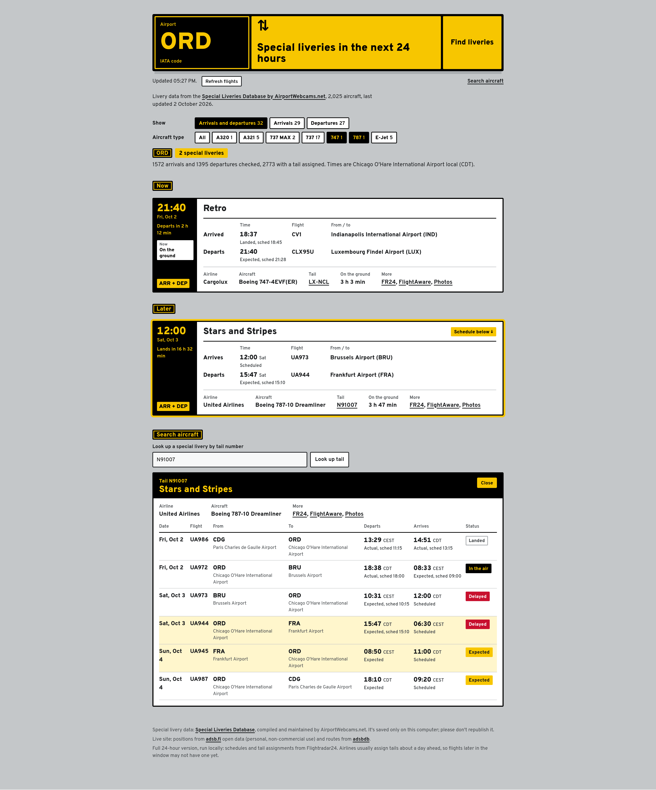

# Livery Watch

Why does this thing exist? I spent too much of my summer watching live SFO planespotting and got addicted, but when I had to go to class again I realized I was missing a lot of interesting airplanes landing at the airport. So I vibecoded this tool to tell me when I need to pull up the stream during my lecture so I can see D-ABYN on short final. 

In other words, what interesting paint jobs will be at a specific airport in the next 24 hours? What are these interesting airplanes doing right now?



## What it does

- Grab the arrival/departure data for a specified airport from FR24 and pick out special-liveried tail numbers, including retro jets, heritage jets, black LH queens, pokemon planes...
- Look up a special-liveried airplane by tail number and get its recent/upcoming flights at all airports

**[Try the demo](https://beverleyy.github.io/special-airplanes/)** featuring a recorded moment at SIN on 03 Oct 2026.

## Run it with live data

```
git clone https://github.com/beverleyy/special-airplanes
cd special-airplanes
python3 -m livery_watch
```

### Home use version

This thingy has no dependencies other than a fairly modern Python installation (Python >3.9) and a functional web browser. It will open the app in the browser, if it doesn't, go to `http://localhost:8024`. The following options are available to customize the app run:

| Option | What it does |
| --- | --- |
| `--host 0.0.0.0` | Listen on your network, for example to use this from a mobile device |
| `--port 9000` | Use a different port |
| `--no-browser` | Don't open a browser window |
| `--source URL` | Also import liveries from another page with a livery table |
| `--verbose` | Log every request made to the databases |

If you use the host option you can access it from another device at `http://<your-computer's-IP>:8024`. If it's not on the same network you will need a VPN to make it so. 

### Portable version

Now you may ask... what happens if you're commuting or your laptop runs out of battery? That's what the portable version is for. It runs with a small Cloudflare Worker behind it, using only free data sources ([adsb.fi](https://adsb.fi) and [adsbdb](https://adsbdb.com)). It shows what's around an airport right now and which special liveries are already in the air en route to the airport, but not flights that haven't taken off yet. Due to data access limitations (see below) an access code is needed to use it, you can set up your own version with these instructions. The only dependency is [Node.js](https://nodejs.org/en) 20+, and a free [Cloudflare](https://cloudflare.com) account. Claude helpfully wrote documentation for this part so, fork this repository and see `INSTALL.md` for the instructions.

## The (not so) fine print

### THIS IS NOT MEANT TO BE RUN AS AN AUTOMATION! PLEASE READ!

**Special livery data:** I pulled from the [Special Liveries Database](https://airportwebcams.net/special-liveries/), compiled and maintained by AirportWebcams.net. The app reorganizes the data from that page into a JSON file so it can be read, and caches this JSON file locally. I strongly recommend NOT republishing this data, which is also why I only have a small demo dataset in this repository.

**Flight schedules, tail assignments, and live positions:** I use [Flightradar24](https://flightradar24.com) to track airplanes. However, I am poor and I don't have access to the API. The reader can draw their own conclusions as to what this means. In other unrelated news, FR24's terms don't permit automations, which is also why I don't have a live demo available. If run locally the app caches the results once when querying the airport and only requests new data for that airport when the user wants it or when the data has become too stale.

**Demo data:** Due to the two abovementioned constraints, in order to put this thingy on my portfolio and hopefully make myself more attractive to the airlines, I had to build a small demo dataset just to show that the thingy works. The `demo-data.json` file only saves, for SIN specifically, the special-liveried flights on 03 Oct 2026 and the live positions for the specific airplanes running those flights at like 5.55am SGT that day. The beauty of using Github is that Pages only serves static files, so I check first for a live instance of the app and if there isn't one then it switches to the demo mode and just uses my small sample dataset.

**Live site data:** positions come from [adsb.fi](https://adsb.fi) open data and routes from [adsbdb](https://www.adsbdb.com), both free for personal, non-commercial use. The Worker reaches adsb.fi through a CORS Anywhere proxy on Render, because adsb.fi refuses requests from Cloudflare's servers. Tail-to-hex codes come from the [tar1090-db](https://github.com/wiedehopf/tar1090-db) aircraft database (Mictronics data). The livery list is uploaded daily by a GitHub Action straight into the Worker's private storage, so it never ends up in this repository.

## To-do list

* At some point I want to add unusual airplane types and not just liveries (for example there's 2 A380s at SFO every day, sometimes 3, out of hella ton of planes, would be cool to show what time they're coming in)
* Maybe when I'm rich I'll buy a FR24 API subscription or find some other equivalent API so I can put this thingy live
* The query can be pretty slow and that's probably because of the search being basically a scrape. I should do something about that
